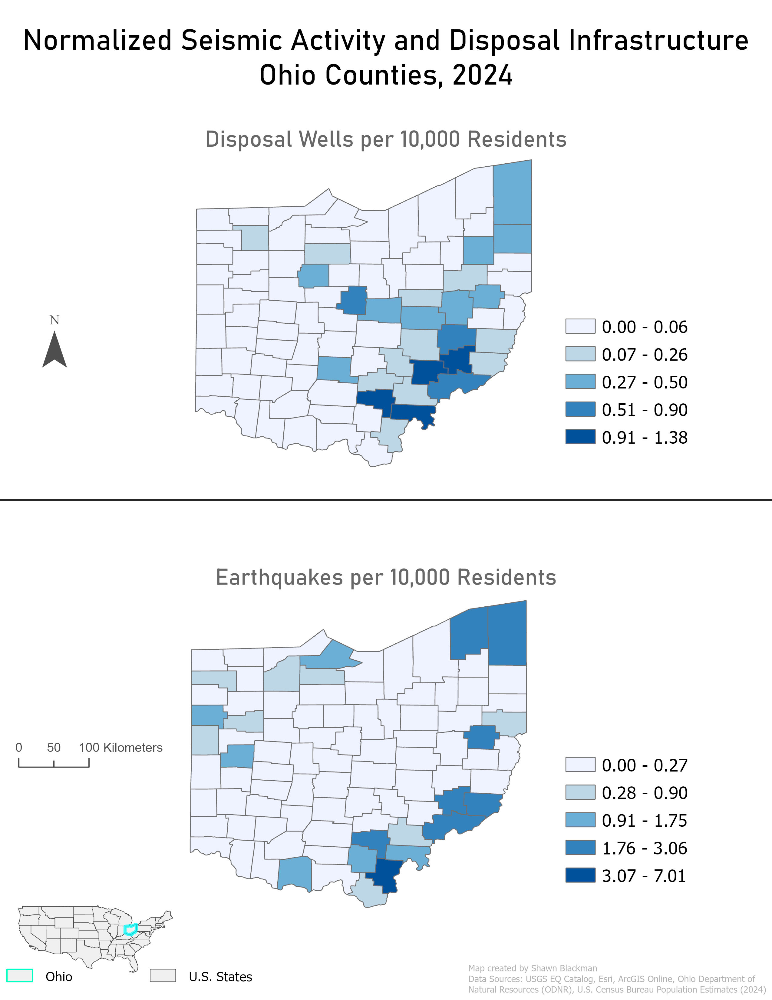
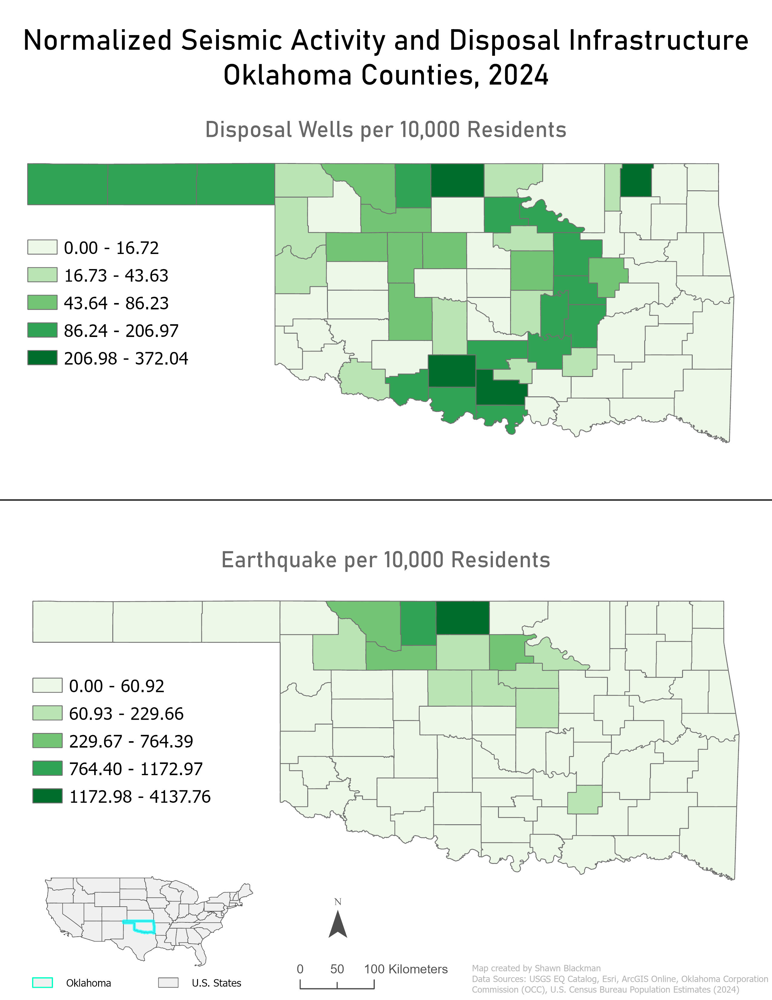
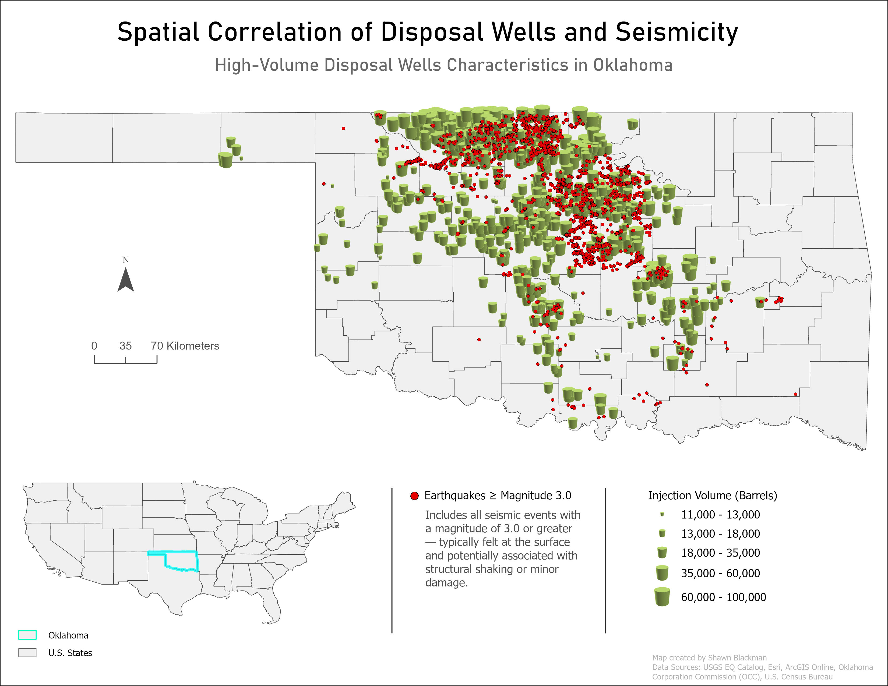
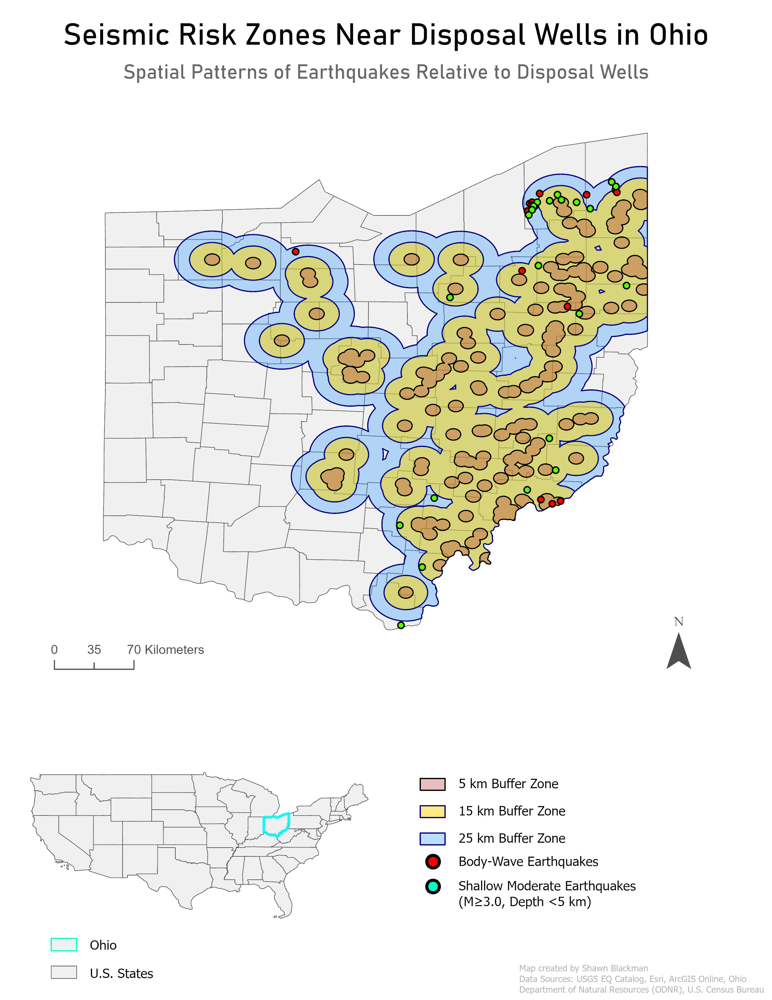
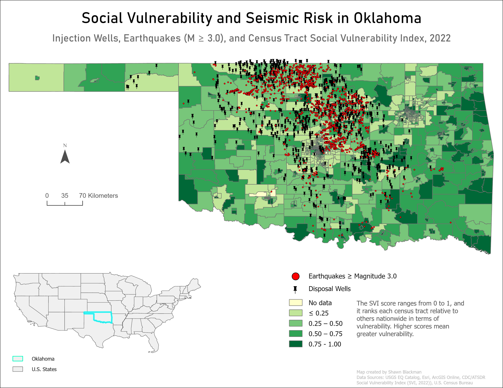

# Mapping Disparate Risk: Induced Seismicity & Social Vulnerability

## Comparative Geospatial Analysis | Oklahoma vs. Ohio

## 🌎 Project Overview

This research investigates the spatial relationship between **Class II wastewater disposal wells**, **anthropogenic seismic activity**, and **Social Vulnerability Indices (SVI)**. By comparing the regulatory and geological landscapes of Oklahoma and Ohio, this study evaluates whether the environmental risks associated with induced seismicity disproportionately impact communities with higher social vulnerability.

## 📊 Key Research Findings

* **The Injection Driver:** Analysis aligns with the scientific consensus that sustained, high-volume wastewater injection—rather than hydraulic fracturing itself—is the primary catalyst for the surge in $M3.0+$ seismic events.
* **Regional Variance:** While Oklahoma experienced a more dramatic "seismic surge" necessitating rapid regulatory intervention, the Ohio analysis highlights the critical intersection of disposal well density and localized fault lines in proximity to vulnerable populations.
* **Social Intersection:** Spatial overlays suggest a recurring correlation between industrial disposal zones and census tracts with elevated SVI scores, raising significant questions regarding environmental justice and hazard mitigation.

## 🗺️ Mapping Artifacts

### 1. Normalized Seismic Activity: Ohio (2024)

*Figure 2: Displays seismic activity and disposal infrastructure density in Ohio per 10,000 residents.*

### 2. Normalized Seismic Activity: Oklahoma (2024)

*Figure 3: Illustrates the basin-wide scale of injection activity and earthquake frequency in Oklahoma.*

### 3. High-Volume Disposal Well Characteristics: Oklahoma

*Figure 4: Bivariate visualization linking injection volume and pressure to seismic moment release.*

### 4. Seismic Risk Zones: Ohio

*Figure 5: Geodesic buffer analysis identifying zones of seismic influence within 5km to 45km of disposal wells.*

### 5. Social Vulnerability & Seismic Risk: Oklahoma

*Figure 6: Spatial correlation between anthropogenic seismic hazards and the CDC Social Vulnerability Index.*

### 6. Social Vulnerability & Seismic Risk: Ohio

*Figure 7: Analysis of hazard exposure within socially vulnerable communities along Ohio's eastern border.*

## 🛠️ Methodology & Technical Stack

* **Software:** ArcGIS Pro (Spatial Analyst & Geostatistical Analyst)
* **Geospatial Techniques:**
  * **Spatial Join:** Correlating seismic event epicenters with specific census tract data.
  * **Bivariate Mapping:** Simultaneously visualizing SVI and Earthquake Frequency to identify overlapping risk zones.

## 📂 Data & Documentation

At this stage of the project, the primary artifacts are the exported cartographic visualizations and the summary research paper.

* **Maps:** High-resolution exports are available in the `/maps` directory.
* **Research Paper:** `Shawn_Blackman_Mapping_Disparate_Risk.docx` (included in root).
* **Technical Data:** *Note: The raw datasets (CSV, Shapefiles, and File Geodatabases) are currently excluded due to file size. These technical assets will be integrated in a future update via Git LFS or external cloud hosting to maintain project reproducibility.*

---
Developed by Shawn Blackman
